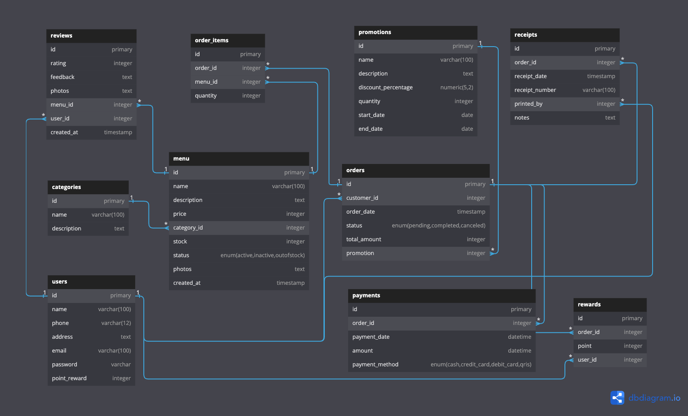

## Soal No 1 🍽️ Restaurant Application

## Desain Database Aplikasi Rumah Makan



## 🚀 Teknologi yang Digunakan

### Backend: Golang dengan Fiber

- 🛠️ **Deployment yang Mudah (Binary Executable)**  
  Aplikasi Go compailer menjadi satu binary executable yang tidak memerlukan runtime atau dependensi eksternal. Ini memudahkan proses deployment ke server atau container (seperti Docker) tanpa harus khawatir tentang kompatibilitas environment.

- ⚡ **Pertimbangan Performance**  
  Go adalah bahasa yang di-compailer, sehingga aplikasi Go berjalan lebih cepat dibandingkan bahasa yang diinterpretasi. Ini penting untuk pengalaman pengguna yang baik, terutama dalam aplikasi restoran dengan ribuan transaksi kedepannya.

- 📖 **Sintaks yang Jelas dan Mudah Dipahami**  
  Penulisan kode Go lebih sederhana dan mudah dibaca, membantu jika ada member baru untuk masuk ke tim mudah beradaptasi dan mulai bekerja dengan code yang sudah dibuat oleh tim.

---

### Database: PostgreSQL

- 🗄️ **Relational Database**  
  PostgreSQL cocok untuk aplikasi yang memerlukan integritas data melalui relasi antar tabel.

- 🚀 **Fitur Lanjutan**  
  Mendukung fitur seperti transaksi, foreign key, dan indexing yang penting untuk performa aplikasi.

---

### Frontend: React

- 🔄 **Komponen Reusable**  
  Arsitektur berbasis komponen memudahkan pengembangan antarmuka yang dinamis dan reusable.

- ⚙️ **State Management**  
  Memungkinkan manajemen state yang lebih baik dengan tools seperti Redux atau Context API, sangat berguna untuk aplikasi dengan data yang kompleks.

- 🌐 **Ecosystem yang Kuat**  
  Dukungan untuk berbagai library dan framework (seperti shadcn UI, framer motion) yang memudahkan dan mempercepat pengembangan.

---

### Laporan dan Analitik: Metabase

- 🖥️ **User-Friendly**  
  Metabase menyediakan antarmuka yang mudah digunakan untuk membuat dashboard dan laporan tanpa memerlukan keahlian teknis mendalam.

- 🔗 **Integrasi Mudah**  
  Dapat diintegrasikan dengan berbagai database, termasuk PostgreSQL dan MySQL.

- 📊 **Visualisasi Data yang Kuat**  
  Menawarkan berbagai pilihan visualisasi untuk membantu memahami data dengan lebih baik.

---

### Integrasi Pembayaran: Stripe

- 🔒 **Keamanan Terjamin**  
  Stripe menawarkan solusi pembayaran yang aman dan mudah.

- ⏱️ **Kemudahan Integrasi**  
  API yang mudah digunakan dan dokumentasi yang lengkap memudahkan integrasi ke dalam aplikasi.

- 💳 **Dukungan Berbagai Metode Pembayaran**  
  Stripe mendukung pembayaran dengan kartu kredit, debit, dan e-wallet.

---

## 📄 Product Requirements Document (PRD)

- **Nama Produk**:  
  Aplikasi MenuKita (Order & Management System)

- **Target Pengguna**:  
  Aplikasi ini akan digunakan oleh **730 monthly active users** (pelanggan dan staf restoran).

- **Fitur Utama**:

  - Manajemen Pesanan: Menerima pesanan makanan secara offline maupun online.
  - Struk Pembelian: Menghasilkan struk digital untuk setiap transaksi.
  - Laporan Keuangan: Laporan harian, mingguan, dan bulanan tentang pemasukan.
  - Manajemen Menu Makanan: Melacak menu makanan dan minuman yang available untuk dijual.

- **Jumlah Pesanan**:  
  Rata-rata **300-an pesanan per hari**, dengan kemungkinan puncak hingga **700-an pesanan di akhir pekan**.

- **Platform**:

  - Backend: Golang dengan PostgreSQL sebagai database.
  - Frontend: ReactJS untuk antarmuka pengguna.

- **Non-Functional Requirements**:

  - **Scalability**: Aplikasi harus bisa menangani peningkatan pengguna hingga **200%** dari jumlah awal dalam 6 bulan ke depan.
  - **Performance**: Waktu respon rata-rata di bawah **500ms** untuk permintaan pengguna.
  - **Security**: Mendukung enkripsi untuk transaksi pembayaran dan data pelanggan.

- **Estimasi Resource dan Cost**:

  - **Server**:
    - 4 CPU dengan 16 GB RAM untuk backend (Go API Server).
    - 2 CPU dengan 4 GB RAM untuk database (PostgreSQL).
    - 2 CPU dengan 8 GB RAM untuk frontend (React).
  - **Storage**: Minimal 500 GB untuk penyimpanan database dan data struk pembelian.
  - **Monthly Cost Estimate**: Sekitar $200-$300 per bulan untuk server cloud seperti AWS atau Google Cloud.

- **Operasional**:
  - **Uptime**: Target uptime minimal **99.5%** (kurang lebih **1,3 jam downtime per bulan**).
  - **Backup**: Data di-backup setiap hari untuk memastikan tidak ada kehilangan data kritis.

---

## 📊 Service Level Agreement (SLA)

- **Availability**:  
  Aplikasi harus memiliki **uptime 99.5%** atau lebih. Jika uptime turun di bawah target, pengguna berhak mendapatkan kompensasi seperti perpanjangan layanan tanpa biaya.

- **Latency**:

  - **Target Latency**: Respon API backend harus di bawah **500ms**.
  - **Spikes**: Pada saat puncak, latency tidak boleh melebihi **6 detik**.

- **Performance Monitoring**:  
  Setiap bulan, dilakukan review performa, termasuk jumlah transaksi yang diproses, waktu respon, dan jumlah pengguna aktif.

- **Support**:

  - **Level 1 (Kritikal)**: Respon dalam waktu 1 jam untuk insiden yang mengakibatkan downtime total.
  - **Level 2 (Moderate)**: Respon dalam waktu 24 jam untuk masalah performa.
  - **Level 3 (Low)**: Respon dalam waktu 3 hari untuk perbaikan bug minor.

- **Data Retention**:  
  Data pesanan, laporan keuangan, dan stok disimpan selama minimal **1 tahun**. Data pelanggan yang tidak aktif lebih dari 1 tahun dapat dihapus.

---

## 📉 Contoh Estimasi Penggunaan dan Beban Sistem

- **100 monthly active users**, dengan estimasi **500 pesanan per hari**.
- **Peak hours** diprediksi pada waktu makan siang (pukul 11:00-13:00) dan makan malam (pukul 17:30-20:00), dengan puncak pesanan bisa mencapai **2 kali lipat** dari rata-rata.
- **Beban database**: 300 pesanan per hari akan menghasilkan sekitar **10.000 transaksi per bulan**, termasuk transaksi detail (item makanan, jumlah, harga, dll).

---

## 💡 Ide untuk Meningkatkan Aplikasi

- 🎁 **Sistem Loyalty atau Poin**  
  Implementasi: Tambahkan tabel `rewards` yang mencatat poin yang diperoleh setiap kali pelanggan melakukan transaksi. Poin dapat ditukarkan untuk diskon atau hadiah tertentu.

- 🛒 **Pemesanan Online**  
  Implementasi: Tambahkan halaman pemesanan di frontend yang memungkinkan pelanggan memilih makanan, menambahkan ke keranjang, dan melakukan checkout. Terintegrasi dengan Stripe untuk pembayaran online.

- 📉 **Notifikasi Stok**  
  Implementasi: Buat sistem yang secara otomatis memantau stok makanan dan mengirim notifikasi kepada manajer jika stok di bawah ambang batas tertentu.

- ⭐ **Ulasan Pelanggan**  
  Implementasi: Tambahkan tabel `reviews` yang memungkinkan pelanggan memberikan rating dan komentar pada makanan yang mereka pesan.

- 💳 **Integrasi Pembayaran Digital**  
  Implementasi: Integrasikan dengan API pembayaran seperti Stripe untuk mendukung pembayaran online, baik melalui e-wallet, kartu kredit, maupun qris.

# Soal No 2 dan Penjelasan Kode

## Ringkasan

Potongan kode ini adalah bagian dari program yang lebih besar yang mensimulasikan permainan dadu. Program ini membutuhkan input untuk jumlah pemain dan jumlah dadu, dan kemudian melanjutkan untuk mensimulasikan putaran permainan. Setiap pemain memulai dengan jumlah dadu yang sama. Di setiap ronde, para pemain bergiliran melempar dadu. Jika seorang pemain melempar dadu angka 1, maka ia akan kehilangan dadu tersebut dan memberikannya kepada pemain berikutnya. Permainan berlanjut hingga hanya satu pemain yang memiliki dadu yang tersisa, dan pemain tersebut dinyatakan sebagai pemenang.

## Contoh Penggunaan

```go
Masukkan jumlah pemain: 3
Masukkan jumlah dadu: 4
==================
Giliran 1 lempar dadu:
Pemain #1 (0): [3 4 5 3]
Pemain #2 (0): [3 1 4 1]
Pemain #3 (0): [5 2 1 4]
Setelah evaluasi:
Pemain #1 (0): [3 4 5 3 1 1 1]
Pemain #2 (0): [3 4]
Pemain #3 (0): [5 2 4]
==================
Giliran 2 lempar dadu:
Pemain #1 (0): [1 2 3 3 1 1 5]
Pemain #2 (0): [2 1]
Pemain #3 (0): [4 5 5]
Setelah evaluasi:
Pemain #1 (0): [2 3 3 5 1 1 1 1]
Pemain #2 (0): [2]
Pemain #3 (0): [4 5 5]
==================
Giliran 3 lempar dadu:
Pemain #1 (0): [2 6 2 1 3 4 5 4]
Pemain #2 (0): [2]
Pemain #3 (0): [1 1 3]
Setelah evaluasi:
Pemain #1 (1): [2 2 3 4 5 4 1 1 1]
Pemain #2 (0): [2]
Pemain #3 (0): [3]
==================
Giliran 4 lempar dadu:
Pemain #1 (1): [4 5 6 4 4 6 4 2 4]
Pemain #2 (0): [3]
Pemain #3 (0): [2]
Setelah evaluasi:
Pemain #1 (3): [4 5 4 4 4 2 4]
Pemain #2 (0): [3]
Pemain #3 (0): [2]
==================
Giliran 5 lempar dadu:
Pemain #1 (3): [6 4 5 1 4 5 6]
Pemain #2 (0): [1]
Pemain #3 (0): [6]
Setelah evaluasi:
Pemain #1 (5): [4 5 4 5 1 1]
Pemain #2 (0): _ (Berhenti bermain karena tidak memiliki dadu)
Pemain #3 (1): _ (Berhenti bermain karena tidak memiliki dadu)
==================
Game berakhir karena hanya pemain #1 yang memiliki dadu.
Game dimenangkan oleh pemain #1 karena memiliki poin lebih banyak dari pemain lainnya.
```

## Analisis Kode

### Masukan

- Jumlah pemain (N)
- Jumlah dadu yang dimiliki setiap pemain (M)

---

### Alur

1. Kode meminta pengguna untuk memasukkan jumlah pemain dan jumlah dadu.
2. Kode ini menciptakan sebuah irisan yang disebut 'pemain' dengan panjang N, di mana setiap elemennya merepresentasikan jumlah dadu untuk seorang pemain.
3. Kode ini memasuki sebuah perulangan yang mensimulasikan putaran permainan.
4. Di setiap putaran, kode ini mencetak nomor putaran dan lemparan dadu pemain saat ini.
5. Kode ini mengevaluasi lemparan dadu dan memperbarui jumlah dadu untuk setiap pemain berdasarkan aturan permainan.
6. Setelah mengevaluasi lemparan dadu, ia mencetak jumlah dadu yang diperbarui untuk setiap pemain.
7. Ini memeriksa apakah hanya ada satu pemain yang tersisa dengan dadu. Jika demikian, maka pemain tersebut dinyatakan sebagai pemenang dan mengakhiri permainan.
8. Jika masih ada beberapa pemain yang memiliki dadu, kode akan menambah jumlah putaran dan melanjutkan ke putaran berikutnya.

---

### Output

- Permainan berlanjut dengan setiap pemain bergiliran melempar dadu.
- Kode mencetak lemparan dadu untuk setiap pemain di setiap ronde.
- Setelah mengevaluasi lemparan dadu, kode akan mencetak jumlah dadu yang diperbarui untuk setiap pemain.
- Jika hanya ada satu pemain yang tersisa dengan dadu, kode menyatakan pemain tersebut sebagai pemenang dan mengakhiri permainan.

---
